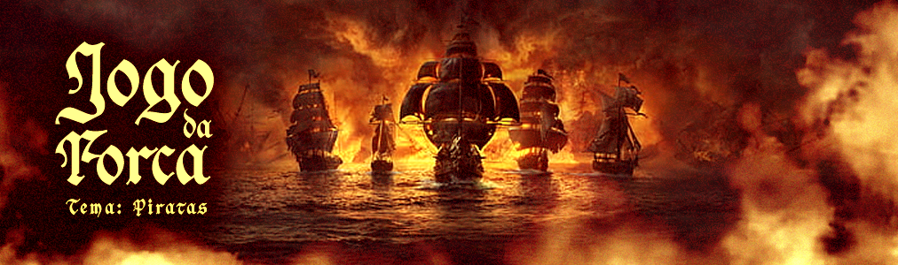

  
  
  
  
  

# 🔮 Jogo da forca com Python
## 📢 Descrição do Projeto
### 🎯 Objetivo

  O projeto tem caráter experimental e visa a prática do conhecimento adquirido na disciplina de Lógica de <b>Programação e Algoritmos</b> e linguagem Python, trabalhando com listas, dicionários, métodos para manipular as listas, funções, condicionais e laços de repetição.

### 🛠️ Ferramentas utilizadas
<ul>
  <li><b>Python:</b> Linguagem de programação principal.</li>
  <li><b>Visual Studio Code:</b> Ambiente de Desenvolvimento Integrado (IDE).</li>
</ul>

## 🎮 Etapas do jogo
### 🕹️ Mecânica do jogo

<ul>
  <li>Para jogar, o jogador deverá adivinhar a palavra que será carregada de uma lista de palavras dentro de um arquivo de texto.</li>
  <li>Ao jogar, o usuário deve digitar seu nome.</li>
  <li>O nome será armazenado no final da jogada, junto com o score que o jogador fez.</li>
  <li>O Usuário perde ao completar 6 erros.</li>
</ul>

### 📊 Contagem de pontos
<ul>
  <li>O nome e o score são armazenados dentro de um arquivo .txt.</li>
  <li>Na opção score do menu é mantido a lista dos jogadores e suas recepectivas pontuações.</li>
</ul>